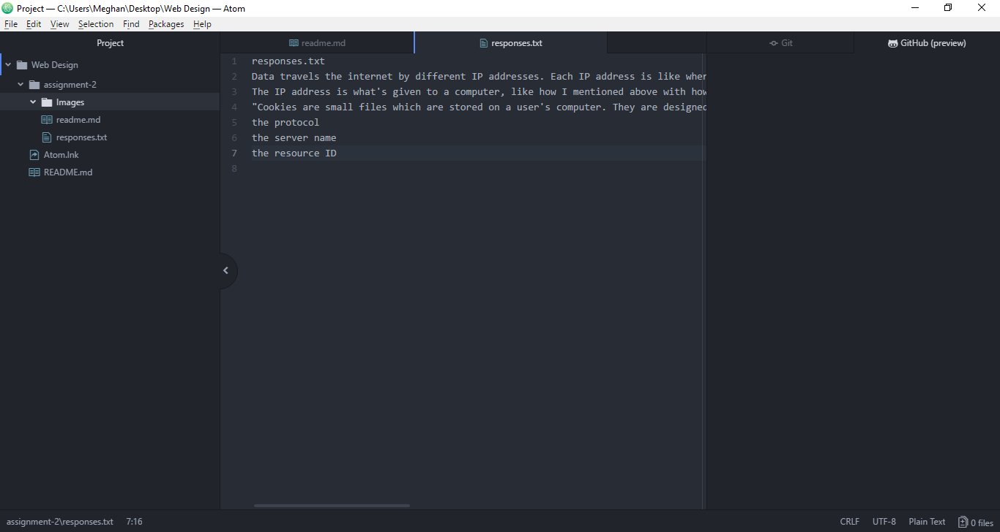

# Assignment 2

Version Control is a system that records changes to a file or set of files over time so that you can recall specific versions later. We're using this because it helps us track our homework and what we've done or possibly messed up in the past, so we can change it. Github Desktop is what transfers our changes to the web so everyone can look.

[Responses Link](./Responses)

I think I have finally figured out the homework for this class and make it so I'm all caught up and not confused anymore. With a big thanks too! And patience!!!

