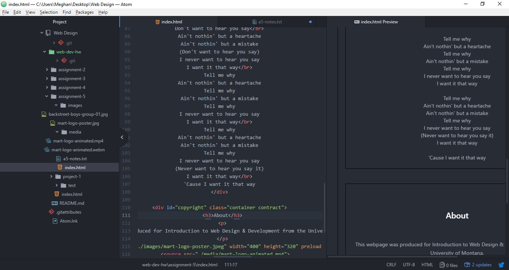

<h1>Assigment 5</h1>
The difference between span and div is that a span element is in-line and usually used for a small chunk of HTML inside a line (such as inside a paragraph) whereas a div (division) element is block-line (which is basically equivalent to having a line-break before and after it) and used to group larger chunks of code.

It's easier to just link a third-party into your website than have to upload an entire file. You just need to put the link to youtube or souncloud basically.

My workcycle for this page consisted on having problems with div. When I would compare to other's work, and view their sources, it didn't quite look like mine.

