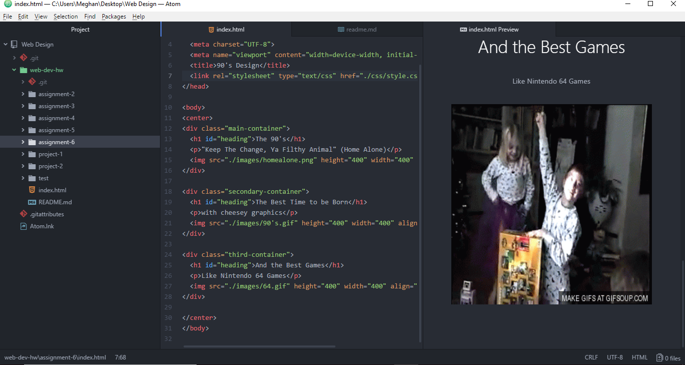

<h1>Assigment 6</h1>

I chose the 90's. I was born in 93 and it's always fun looking back at how bad the graphics use to be on TV and powerpoint. Also, looking up the old games. 

The colors I used were black, hot pink and blue. I thought about using yellow, but I really didn't like it as a background, I thought it was a little too much on the eyes. Black makes the other colors easy to see.

My work cycle for this assignment was a little easier than in the past. I kind of like css, it's something separate from the html, so it made all of the coding loo cleaner to me.

