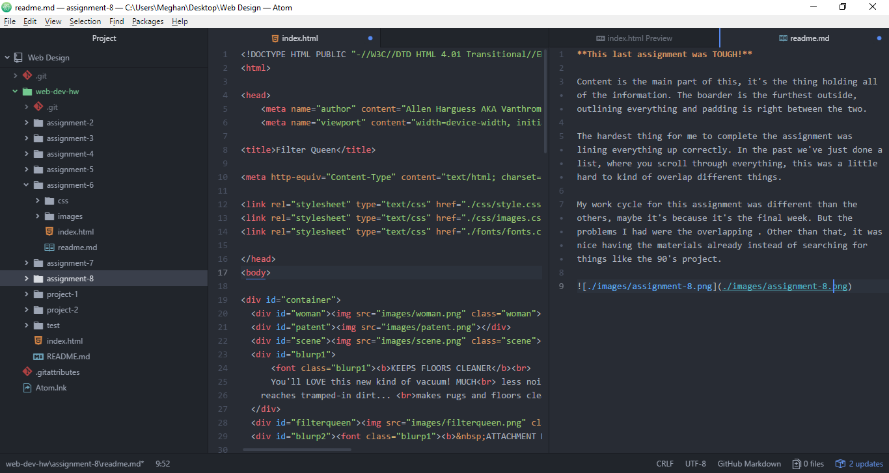

**This last assignment was TOUGH!**

Content is the main part of this, it's the thing holding all of the information. The boarder is the furthest outside, outlining everything and padding is right between the two.

The hardest thing for me to complete the assignment was lining everything up correctly. In the past we've just done a list, where you scroll through everything, this was a little hard to kind of overlap different things.

My work cycle for this assignment was different than the others, maybe it's because it's the final week. But the problems I had were the overlapping . Other than that, it was nice having the materials already instead of searching for things like the 90's project.

