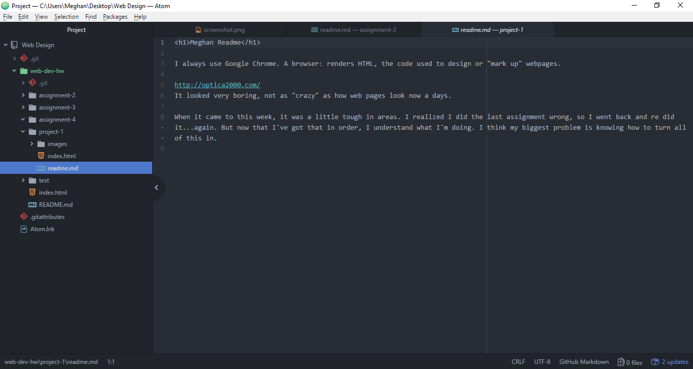

<h1>Meghan Readme</h1>

I always use Google Chrome. A browser: renders HTML, the code used to design or "mark up" webpages.

It looked very boring, not as "crazy" as how web pages look now a days.

When it came to this week, it was a little tough in areas. I realized I did the last assignment wrong, so I went back and re did it...again. But now that I've got that in order, I understand what I'm doing. I think my biggest problem is knowing how to turn all of this in.

[Go to Optica](http://optica2000.com/)

