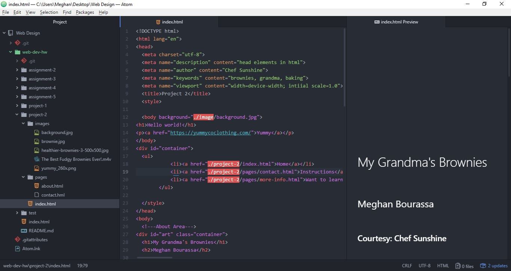

**Project 2**
I think what makes HTML difficult for me is that it looks like ciaos. You have to be very organized when you type an html file. So, when you're someone like me who's not very organized like that, it does make it a little hard. And hard on the eyes.

What I'm hoping to learn on this new section is if it's just as complicated as HTML.... or wores. Fingers crossed that it's not!!

When it came to his project, I was kind of all over the place. It was definitely more difficult trying to keep track of three different pages that you have to link.

